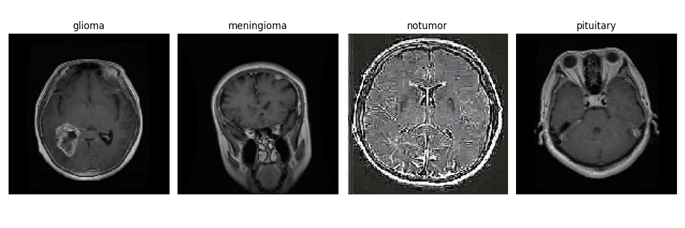
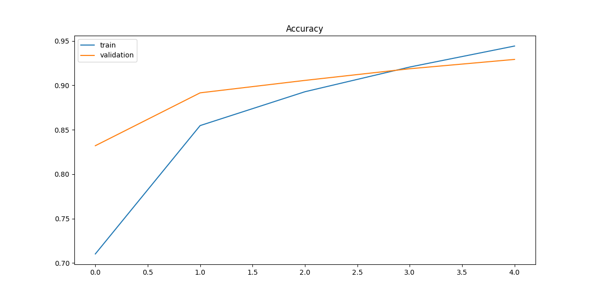
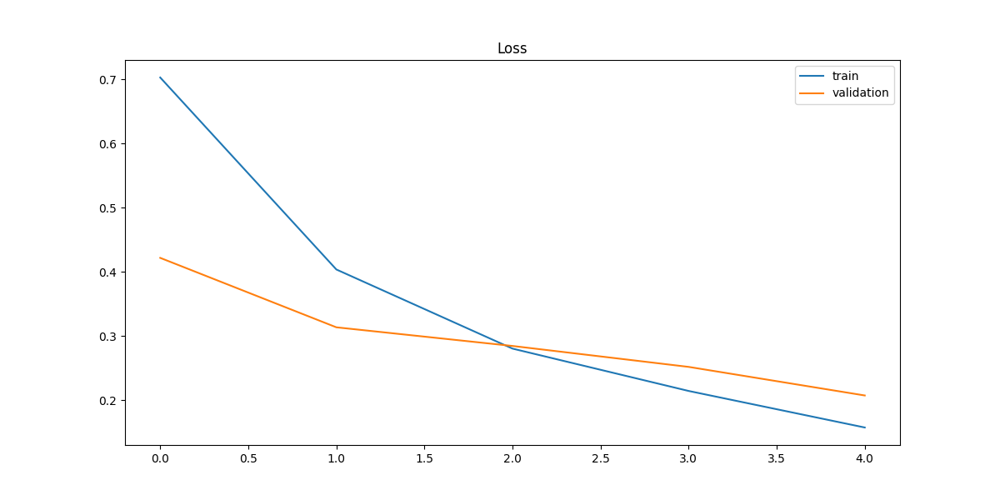
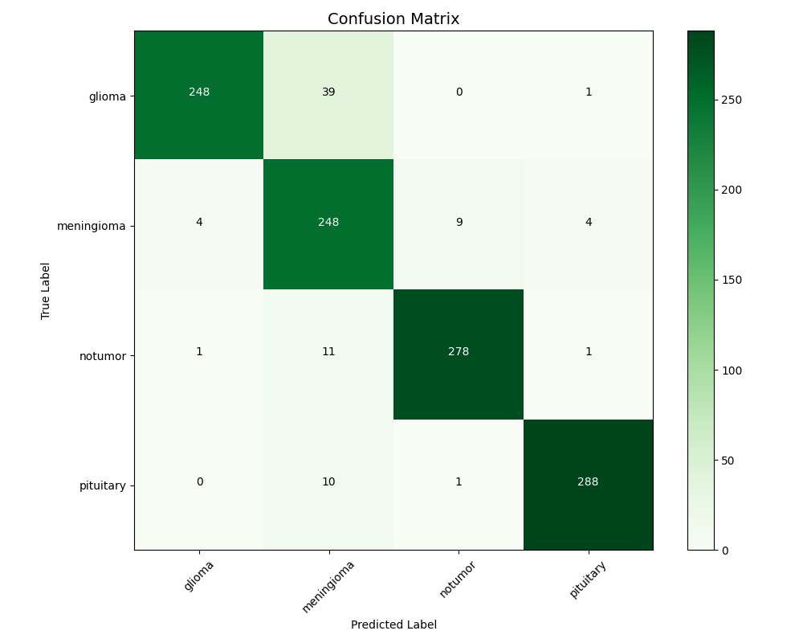

# Brain Tumor MRI Classification (CNN)

This project implements a Convolutional Neural Network (CNN) to classify brain MRI scans into four different categories: glioma, meningioma, no tumor, and pituitary tumors.

## Overview

Brain tumor detection and classification is a critical medical imaging task. Gliomas represent 30% of all brain tumors. Meningiomas account for 20-30% of intracranial tumors, affecting 7.8 per 100,000 people annually. Pituitary tumors constitute 10-15% of intracranial neoplasms with 77-94 cases per 100,000 people. This deep learning project aims to accurately classify these distinct tumor types from MRI images .

## Dataset

The project uses the "Brain Tumor MRI Dataset" from Kaggle, which contains MRI scans across four classes:
- Glioma
- Meningioma
- No tumor
- Pituitary tumor

The dataset is downloaded directly using the Kaggle Hub API. And the images look somehting like the images shown below.



## Model Architecture

The CNN architecture consists of:
- Three convolutional blocks with increasing numbers of filters (32 → 64 → 128)
- Max pooling layers after each convolutional block
- Dropout for regularization (0.5)
- Dense layers for final classification

```
Model: "sequential"
_________________________________________________________________
Layer (type)                 Output Shape              Param #   
=================================================================
conv2d (Conv2D)              (None, 150, 150, 32)      896       
_________________________________________________________________
max_pooling2d (MaxPooling2D) (None, 75, 75, 32)        0         
_________________________________________________________________
conv2d_1 (Conv2D)            (None, 75, 75, 64)        18,496    
_________________________________________________________________
max_pooling2d_1 (MaxPooling2 (None, 37, 37, 64)        0         
_________________________________________________________________
conv2d_2 (Conv2D)            (None, 37, 37, 128)       73,856    
_________________________________________________________________
max_pooling2d_2 (MaxPooling2 (None, 18, 18, 128)       0         
_________________________________________________________________
flatten (Flatten)            (None, 41472)             0         
_________________________________________________________________
dense (Dense)                (None, 128)               5,308,544 
_________________________________________________________________
dropout (Dropout)            (None, 128)               0         
_________________________________________________________________
dense_1 (Dense)              (None, 4)                 516       
=================================================================
Total params: 5,402,308
Trainable params: 5,402,308
Non-trainable params: 0
_________________________________________________________________
```

## Results

As you can see in the figures below, this model achieved with 5 epochs an accruacy of around 95% during the training and a bit lower with the validation set. 



Somewhat similar is the plot of the loss, a bit better in the training set than the validation set. The final validation loss of ~0.21 is relatively low but not optimal. In medical applications, lower loss values (closer to 0.1) are often targeted.



Finally in the confussion matrix we can see that the most confused class is the meningioma, which is confused with glioma quite a bit. This confusion is expected as these tumor types can share imaging characteristics on MRI. The model performs exceptionally well on pituitary tumors (288/299 correct) and no-tumor cases (278/291 correct), which is critical for reducing false negatives.



## Side Notes

I have saved the model into the model folder if anyone wants to load the model. This model is saved with .keras extenseion. It can be loaded in tensorflow using 

```python
    import tensorflow as tf
    model = tf.keras.models.load_model('path/to/your_model.keras')
```

Be aware that in order to use the model you will have to preprocess the data the same as in the .py file in src folder.